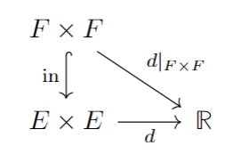

# Подпространства метрического пространства

Пусть $F \subseteq E$ — непустое подмножество метрического пространства $E$ с расстоянием $d$, тогда $F \times F \subseteq E \times E$ — непустое подмножество, тогда мы имеем следующую коммутативную диаграмму



т. е., **сужая** метрику $d$ на $F$, мы получаем метрическое пространство $(F,d|_{F \times F})$, которое мы будем для простоты обозначать $(F, d_F)$.

:::{prf:definition}
Метрическое пространство, определённое таким образом, называется **подпространством** $F$ метрического пространства $E$.
:::

```{figure} ./images/open_in_F.jpg
Пусть $E = \mathbb{R} \times \mathbb{R}$ — обыкновенная плоскость с обыкновенной евклидовой метрикой $d(\m{x},\m{y}) = \sqrt{(x_1 - y_1)^2+ (x_2 - y_2)^2}$, и пусть $F = \mathbb{R}$, которую мы можем понимать как множество вида $\{(x,0), x\in \mathbb{R}\}$. На рисунке $F$ отождествлена с осью $Ox$. Тогда, сужая метрику $d$ на $F$, мы получаем, что $d(x,y) = \sqrt{(x-y)^2} = |x-y|$. Более того, ясно, что любой интервал $(a,b)$ можно получить, пересекая открытый круг с $F.$
```


:::{prf:proposition}
:name: open_in_subset
Для того чтобы множество $S \subseteq F$ было открыто в подпространстве $F$, необходимо и достаточно, чтобы существовало такое множество $\mathscr{U}$, открытое в $E$, что $S = \mathscr{U} \cap F.$
:::

:::{prf:proof}
:class: dropdown
:nonumber:
Прежде всего, поймём, что есть открытый шар в $F$. Пусть $a \in F$, и рассмотрим открытый шар $B(a,r) \subseteq E$, тогда получаем
$$\begin{eqnarray}
F \cap B(a,r) &:=& \{x \in E \cap F\, :\, d(x,a)<r\} \\
&=&\{x\in F\, :\, d(x,a)<r\} \\
&=& \{x \in F\, :\, d_F(x,a)<r\},
\end{eqnarray}$$
т. е. $F \cap B(a,r)$ — это **открытый шар в $F$ с центром в точке $a$ радиуса $r.$**

:::{warning}
Обратим внимание, что если $F = \mathbb{R}_{\ge 0} \subseteq \mathbb{R} = E$, $d(x,y) = |x-y|$, то, например, $[0,1)$ — открытый шар в $F = \mathbb{R}_{\ge 0}$, так как $[0,1) = (-1,1) \cap \mathbb{R}_{\ge 0}$. Hо! В $\mathbb{R}$, $[0,1)$ и не открыт и не замкнут!

(1) Пусть $\mathscr{U}$ — открытое множество в $E$, и пусть $x \in \mathscr{U} \cap F$. Так как $\mathscr{U}$ — открытое в $E$, то найдётся шар $B(x,r) \subseteq E$ такой, что $B(x,r) \subseteq \mathscr{U}$. Тогда $F \cap B(x,r) \subseteq F \cup \mathscr{U}$. Но мы уже поняли, что $B(x,r) \cap F$ — открытый шар в $F$, но тогда включение $F \cap B(x,r) \subseteq F \cup \mathscr{U}$ и означает, что $\mathscr{U} \cap F$ открыто в $F$, ибо $x$ — произвольная точка в $\mathscr{U} \cap F.$
(2) Пусть $S$ открыто в $F$, это значит, что для любой точки $x \in S$ можно найти открытый шар $B(x, r(x)) \subseteq E$ такой, что $F \cap B(x,r(x)) \subseteq S$ (т.к., $F \cap B(x,r(x))$ — это открытый шар в $F$).
Тогда 
$$
S = \bigcup_{x \in S} F \cap B(x, r(x)) = F \cap \mathscr{U},
$$
где $\mathscr{U} = \cup_{x\in S} B(x, r(x)) \subseteq E$, тогда по Леммам [](#open_ball=open), [](#union_and_cap_of_open} $\mathscr{U}$ открыто в $E$.
:::

